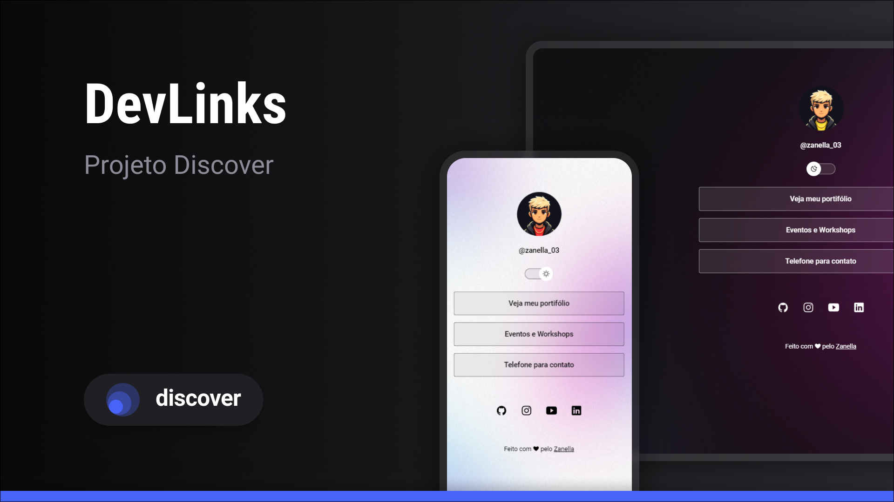

<h1 align="center"> DevLinks </h1>

  Programa exclusivo e gratuito, sendo realizado com auxílio da Rocketseat.

  <a href="#-tecnologias">Tecnologias</a> |
  <a href="#-projeto">Projeto</a> |
  <a href="#-licence">Licence</a> 

  

## 🚀 Tecnologias

- HTML e CSS
- JavaScript
- Git e Github
 
 ##  💻 Projeto

  O DevLinks é um site de links para usar como um cartão de visitas online.

 ## 📝 Licença

  Projeto está sob a licença MIT.

 ---

 Feito com ❤ by Zanella 🖐🏼