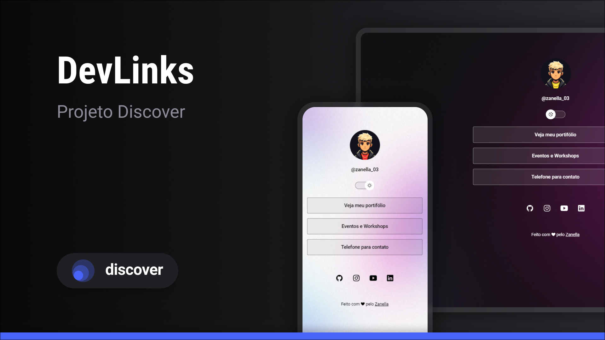

<h1 aling="center"> DevLinks </h1>

  Programa exclusivo e gratuito, sendo realizado com auxílio da Rocketseat.

  <a href="#-tecnologias">Tecnologias</a>
   
  <a href="#-projeto">Projeto</a>
   
  <a href="#-licence">Licence</a>

  

## Tecnologias

- HTML e CSS
- JavaScript
- Git e Github
 
 ## Projeto

 O DevLinks é um site de links para usar como um cartão de visitas online.

 ## Licença

 Projeto está sob a licença MIT.

 ---

 Feito com ❤ by Zanella